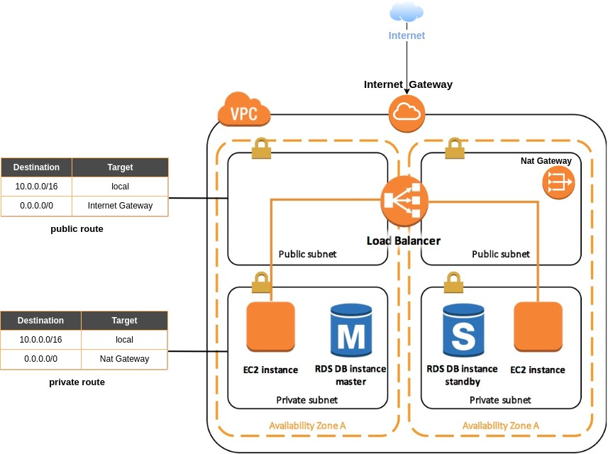
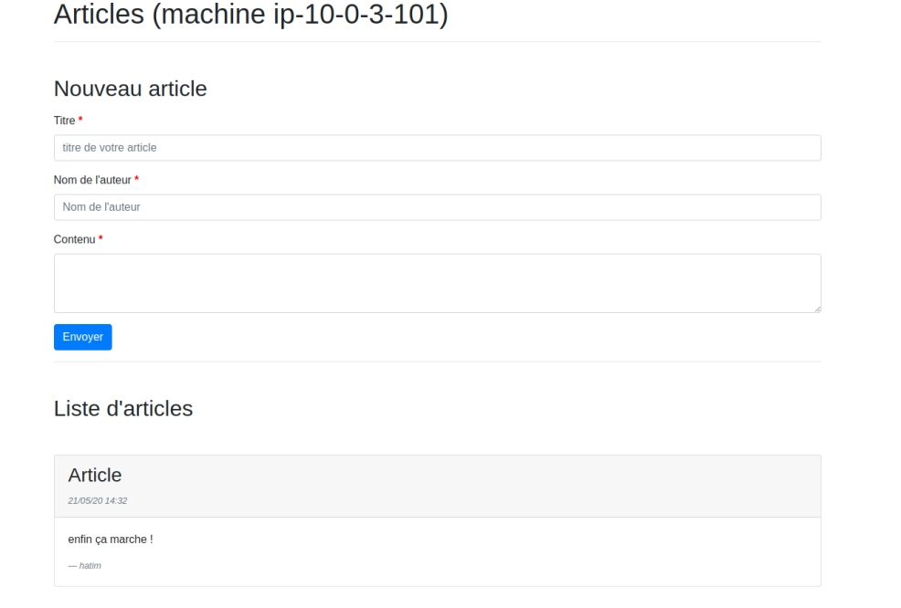

# terraform-aws

## Description

Builds a highly available AWS infrastructure from Terraform for a php web application communicating with a database.




## Modules

| name                    |  usage |
|-------------------------|--------|
| `vpc`                   | Creates VPC  with two public subnets for your ELB and two private subnets for your EC2 instances and your RDS service on different AZs| 
| `alb_asg`               | Creates an Auto Scaling group with ELB of type "application" |
| `cloudwatch_cpu_alarms` | Creates a cloudwatch alarms depending on the CPU usage and triggering ASG operations |    
| `s3`                    | Creates an S3 bucket on which the sources of your application will be put |
| `ec2_role_allow_s3`     | Creates an instance profile using an iam role authorizing access to S3 from your EC2 instances |
| `rds`                   | Creates a mariadb relational database used for our EC2 web instances | 

## How it works 

To use this project, you must first indicate the root password of our database. Maybe you can use to define it in a file called `terraform.tfvars` (this file name is automatically considered by Terraform during the execution of your configuration). Example :

```tfvars
db_password = "your-password"
```

Second, you must then create your ssh key pair in the `keys` folder. Maybe you can use the `ssh-keygen` command as follows :

```shell
ssh-keygen -t rsa

Generating public/private rsa key pair.
Enter file in which to save the key (/home/hatim/.ssh/id_rsa): ./keys/terraform
Enter passphrase (empty for no passphrase): 
Enter same passphrase again: 
```

Then add the path of your public key in your root module in the `path_to_public_key` parameter of the `my_alb_asg module`. Maybe it will be :

```hcl
module "my_alb_asg" {
    ...
    ...
    path_to_public_key   = "/home/hatim/Documents/tmp/terraform/sources/keys/terraform.pub"
    ...
    ...
}
```

You can then launch your configuration with the following command

```shell
terraform init && terraform apply
```

Result :

```
...
...

Outputs:

alb_dns_name = [DNS OF YOUR ELB] 
```

Finally open your browser and test your application from the dns name of your ELB :



---

## Suggested Procedure

Below are some suggestions for the procedure to follow when creating your infrastructure. Feel free to follow it entirely or partially.

### VPC

Suggested procedure for the network part:

1. Create a VPC with an IPv4 CIDR block of `10.0.0.0/16`.
2. Create two public subnets on two different availability zones with IPv4 CIDR blocks `10.0.1.0/24` and `10.0.2.0/24`.
3. Create two private subnets on the same availability zones as the public subnets with IPv4 CIDR blocks `10.0.3.0/24` and `10.0.4.0/24`.
4. Create the Internet Gateway.
5. Create a static IP address with the Elastic IP service to attach to your NAT Gateway.
6. Create the NAT Gateway.
7. Create a public and a private route table to associate with their respective subnets.
8. Create a destination route `0.0.0.0/0` to your Internet Gateway in the public route table.
9. Create a destination route `0.0.0.0/0` to your NAT Gateway in the private route table.

### S3 and IAM Role

Suggested procedure for creating your IAM role and S3 bucket:

1. Create an S3 bucket with a unique name and a pre-configured ACL of type `private`, so that no one else will have access rights to your bucket (except the owner). You must also find a way to automatically upload the web application sources to your bucket 😉.
2. Create a role attached to EC2 services with a policy that allows full access to S3 services.
3. Create an instance profile to pass the role information created above to your EC2 instances when they start.

> You can use VPC Endpoints to connect to your S3 service using a private network instead of the internet. You also have the option to create a bastion host, which is simply an EC2 instance on your public subnet that is allowed to connect via SSH to your EC2 instances located in your private subnets.

### ELB and ASG

Suggested procedure for creating your load balancer and Auto Scaling Group:

1. Create a Security Group for your ASG allowing only traffic from your ELB on port 80.
2. Create a Security Group for your ELB allowing only traffic from the internet on port 80.
3. Create a Target Group on port 80 to help your ELB route HTTP requests to the instances in your ASG.
4. Create your Application Load Balancer attached to your public subnet and ELB security group.
5. Create an HTTP Listener attached to your ELB and Target Group to determine how your load balancer routes requests to the targets registered in your Target Group.
6. Create a Launch Configuration for your ASG specifying the AMI, instance type (`t2.micro` to stay within the AWS free tier), instance profile with your IAM role, user-data, key pair, and security group to use on your ASG instances.
7. Create your Auto Scaling Group specifying the launch configuration created above, the private subnets on which your instances will launch, your Target Group, an `ELB` health check type, and the desired/minimum/maximum number of instances.

> To have your EC2 instance already ready and configured instantly during a scale-up event, you can choose between creating and using a custom AMI or configuring everything from the user-data. For this project, the user-data method was used to concretely show the commands executed when new EC2 instances are created.

### RDS

Suggested procedure for creating your relational database:

1. Create a Security Group allowing only traffic from your web instances on port `3306`.
2. Create a `mariadb` database using the RDS service. It will be attached to your private subnet and the security group created above. Make sure your MariaDB instance has a `db.t2.micro` class, a maximum of 20 GB of storage, and automated backups enabled with a retention period of one day to remain eligible for the AWS free tier. Finally, verify that the `Multi-AZ` option is enabled.

### CloudWatch Alarm

Suggested procedure for creating your CloudWatch alarm based on average CPU usage:

1. Create two Auto Scaling policies, one for scale-up and one for scale-down. The policies will be of type `SimpleScaling` to increase or decrease the current capacity of your ASG based on a single adjustment (e.g., CPU usage). The adjustment type will be `ChangeInCapacity` with a value of `1` for the scale-up policy to add a single instance, and `-1` for the scale-down policy to remove a single instance.
2. Create two CloudWatch alarms: one based on the `CPUUtilization` metric with a threshold greater than or equal to 80% CPU usage to trigger the ASG scale-up policy, and another for usage below 5% to trigger the ASG scale-down policy.

> You can go further by creating email notifications via the AWS SNS service when one of the ASG policies is triggered.


